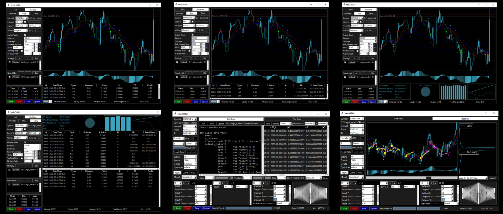

# Algo Trade GUI.

## A graphical interface for real-time backtesting and algorithmic trading strategies with AI integration.

## This is a GUI for you to use personally, non-commercially,
## making it work with your own code in the backend using embedded language or
## as a map to create it with another language like QT with C++.

## Live Backtesting
### Run tests with historical data and view results in real time.

## AI Integration
### Uses artificial intelligence models to improve trading strategies.

## Intuitive Interface
### Designed for easy interaction and analysis of results.

## Screenshots

## Technologies used
### Python is the project's main language. Using specific libraries for data analysis and creating graphical interfaces.

## License
## This project is not currently openly licensed. All rights reserved. For personal use only.